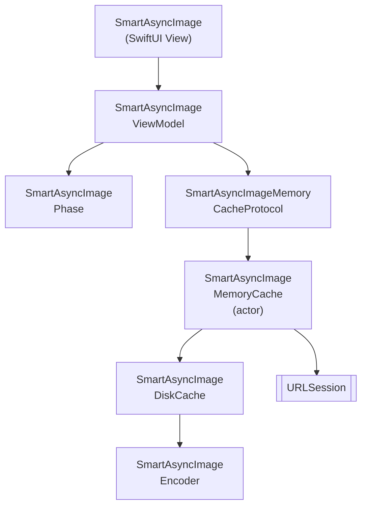

# SmartAsyncImage

Un `AsyncImage` para SwiftUI (iOS) más inteligente y rápido, con caché en memoria y en disco, cancelación y concurrencia de Swift 6.

[](https://github.com/gentle-giraffe-apps/SmartAsyncImage/actions/workflows/ci.yml)
[](https://codecov.io/gh/gentle-giraffe-apps/SmartAsyncImage)
[](https://swift.org)

[](https://swift.org/package-manager/)
[](https://developer.apple.com/ios/)


[](https://app.deepsource.com/gh/gentle-giraffe-apps/SmartAsyncImage/)

> 🌍 **Idioma** · [English](../README.md) · Español · [Português (Brasil)](README.pt-BR.md) · [日本語](README.ja.md) · [简体中文](README.zh-CN.md) · [한국어](README.ko.md) · [Русский](README.ru.md)

## Características
- API compatible con SwiftUI con un view model observable
- Manejo inteligente de fases: `empty`, `loading`, `success(Image)`, `failure(Error)`
- Protocolo de caché en memoria con implementaciones intercambiables
- Caché en disco para persistencia entre ejecuciones
- Concurrencia de Swift (`async/await`) con cancelación cooperativa
- Actualizaciones de estado seguras en MainActor

💬 **[Participa en la discusión. Comentarios y preguntas son bienvenidos](https://github.com/gentle-giraffe-apps/SmartAsyncImage/discussions)**

## Requisitos
- iOS 17+
- Swift 6.1+
- Swift Package Manager

## 📦 Instalación (Swift Package Manager)

### Vía Xcode

1. Abre tu proyecto en Xcode
2. Ve a **File → Add Packages...**
3. Ingresa la URL del repositorio: `https://github.com/gentle-giraffe-apps/SmartAsyncImage.git`
4. Elige una regla de versión (o `main` durante el desarrollo)
5. Agrega el producto **SmartAsyncImage** a tu target de la app

### Vía `Package.swift`

```swift
dependencies: [
    .package(url: "https://github.com/gentle-giraffe-apps/SmartAsyncImage.git", from: "1.0.0")
]
```

Luego agrega `"SmartAsyncImage"` a las `dependencies` de tu target.

## App de Demostración

Se incluye una app de demostración en SwiftUI en este repositorio usando una referencia local al paquete.

**Ruta:**
```
Demo/SmartAsyncImageDemo/SmartAsyncImageDemo.xcodeproj
```

### Cómo Ejecutar
1. Clona el repositorio:
   ```bash
   git clone https://github.com/gentle-giraffe-apps/SmartAsyncImage.git
   ```
2. Abre el proyecto de demostración:
   ```
   Demo/SmartAsyncImageDemo/SmartAsyncImageDemo.xcodeproj
   ```
3. Selecciona un simulador con iOS 17+.
4. Compila y ejecuta (⌘R).

El proyecto está preconfigurado con una referencia local de Swift Package a `SmartAsyncImage` y debería ejecutarse sin configuración adicional.

## Uso

### Ejemplo Rápido (SwiftUI)
```swift
import SwiftUI
import SmartAsyncImage

struct MinimalRemoteImageView: View {
    let imageURL = URL(string: "https://picsum.photos/300")

    var body: some View {

        // reemplaza: AsyncImage(url: imageURL) { phase in
        // ------------------------------------------------
        // con:

        SmartAsyncImage(url: imageURL) { phase in

        // ------------------------------------------------

            switch phase {
            case .empty, .loading:
                ProgressView()
            case .success(let image):
                image.resizable().scaledToFit()
            case .failure:
                Image(systemName: "photo")
            }
        }
        .frame(width: 150, height: 150)
    }
}
```

## Calidad y Herramientas

Este proyecto aplica controles de calidad mediante CI y análisis estático:

- **CI:** Todos los commits a `main` deben pasar las verificaciones de GitHub Actions
- **Análisis estático:** DeepSource se ejecuta en cada commit a `main`.
  La insignia indica el número actual de problemas pendientes de análisis estático.
- **Cobertura de tests:** Codecov reporta la cobertura de líneas para la rama `main`

<sub><strong>Captura de Codecov</strong></sub><br/>
<a href="https://codecov.io/gh/gentle-giraffe-apps/SmartAsyncImage">
  
</a>

Estas verificaciones tienen como objetivo mantener el sistema de diseño seguro para evolucionar con el tiempo.

---

## Arquitectura



---

## 🤖 Nota sobre Herramientas

Partes de la redacción y el refinamiento editorial en este repositorio fueron aceleradas utilizando modelos de lenguaje grandes (incluyendo ChatGPT, Claude y Gemini) bajo diseño, validación y aprobación final humana directa. Todas las decisiones técnicas, el código y las conclusiones arquitectónicas son de autoría y verificación del mantenedor del repositorio.

---

## 🔐 Licencia

Licencia MIT
Libre para uso personal y comercial.

---

## 👤 Autor

Creado por **Jonathan Ritchey**
Gentle Giraffe Apps
Ingeniero Senior de iOS --- Swift | SwiftUI | Concurrency


