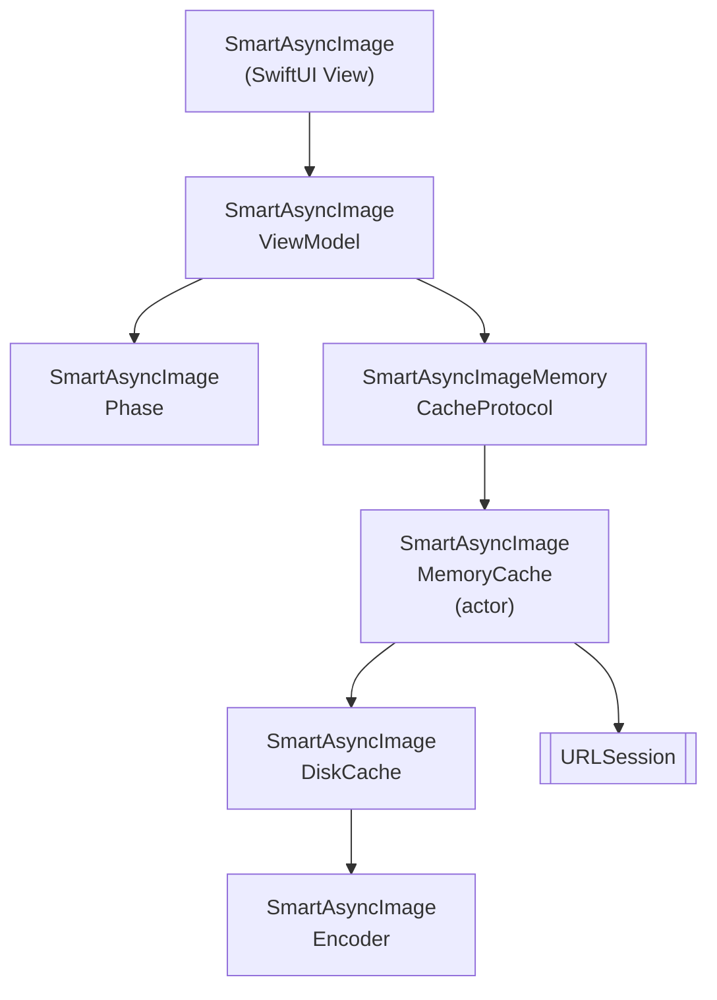

# SmartAsyncImage

SwiftUI (iOS) 向けの、より高速でスマートな `AsyncImage`。メモリ・ディスクキャッシュ、キャンセル、Swift 6 の並行処理を内蔵しています。

[](https://github.com/gentle-giraffe-apps/SmartAsyncImage/actions/workflows/ci.yml)
[](https://codecov.io/gh/gentle-giraffe-apps/SmartAsyncImage)
[](https://swift.org)

[](https://swift.org/package-manager/)
[](https://developer.apple.com/ios/)


[](https://app.deepsource.com/gh/gentle-giraffe-apps/SmartAsyncImage/)

> **言語** · [English](../README.md) · [Español](README.es.md) · [Português (Brasil)](README.pt-BR.md) · 日本語

## 特徴
- Observable なビューモデルを備えた SwiftUI 対応 API
- スマートなフェーズ管理: `empty`、`loading`、`success(Image)`、`failure(Error)`
- プラグイン可能な実装を持つメモリキャッシュプロトコル
- アプリの再起動をまたぐディスクキャッシュ
- Swift Concurrency (`async/await`) による協調的キャンセル
- MainActor で安全な状態更新

💬 **[ディスカッションに参加しましょう。フィードバックや質問を歓迎します](https://github.com/gentle-giraffe-apps/SmartAsyncImage/discussions)**

## 要件
- iOS 17+
- Swift 6.1+
- Swift Package Manager

## 📦 インストール (Swift Package Manager)

### Xcode 経由

1. Xcode でプロジェクトを開く
2. **File → Add Packages...** に移動
3. リポジトリ URL を入力: `https://github.com/gentle-giraffe-apps/SmartAsyncImage.git`
4. バージョンルールを選択（開発中は `main` でも可）
5. **SmartAsyncImage** プロダクトをアプリターゲットに追加

### `Package.swift` 経由

```swift
dependencies: [
    .package(url: "https://github.com/gentle-giraffe-apps/SmartAsyncImage.git", from: "1.0.0")
]
```

次に、ターゲットの `dependencies` に `"SmartAsyncImage"` を追加します。

## デモアプリ

ローカルパッケージ参照を使用した SwiftUI デモアプリがこのリポジトリに含まれています。

**パス:**
```
Demo/SmartAsyncImageDemo/SmartAsyncImageDemo.xcodeproj
```

### 実行方法
1. リポジトリをクローン:
   ```bash
   git clone https://github.com/gentle-giraffe-apps/SmartAsyncImage.git
   ```
2. デモプロジェクトを開く:
   ```
   Demo/SmartAsyncImageDemo/SmartAsyncImageDemo.xcodeproj
   ```
3. iOS 17+ のシミュレーターを選択
4. ビルドして実行 (⌘R)

プロジェクトは `SmartAsyncImage` へのローカル Swift Package 参照で事前設定されており、追加の設定なしで実行できます。

## 使い方

### クイックサンプル (SwiftUI)
```swift
import SwiftUI
import SmartAsyncImage

struct MinimalRemoteImageView: View {
    let imageURL = URL(string: "https://picsum.photos/300")

    var body: some View {

        // 置き換え前: AsyncImage(url: imageURL) { phase in
        // ------------------------------------------------
        // 置き換え後:

        SmartAsyncImage(url: imageURL) { phase in

        // ------------------------------------------------

            switch phase {
            case .empty, .loading:
                ProgressView()
            case .success(let image):
                image.resizable().scaledToFit()
            case .failure:
                Image(systemName: "photo")
            }
        }
        .frame(width: 150, height: 150)
    }
}
```

## 品質とツール

このプロジェクトは CI と静的解析によって品質ゲートを適用しています:

- **CI:** `main` へのすべてのコミットは GitHub Actions のチェックを通過する必要があります
- **静的解析:** DeepSource が `main` へのすべてのコミットで実行されます。
  バッジは現在の未解決の静的解析問題の数を示しています。
- **テストカバレッジ:** Codecov が `main` ブランチのラインカバレッジをレポートします

<sub><strong>Codecov スナップショット</strong></sub><br/>
<a href="https://codecov.io/gh/gentle-giraffe-apps/SmartAsyncImage">
  
</a>

これらのチェックは、設計システムが安全に進化し続けられるようにすることを目的としています。

---

## アーキテクチャ



---

## 🤖 ツールに関する注記

このリポジトリの草稿作成および編集の一部は、大規模言語モデル (ChatGPT、Claude、Gemini を含む) を使用して加速されましたが、人間による直接的な設計、検証、最終承認のもとで行われています。すべての技術的決定、コード、アーキテクチャ上の結論は、リポジトリメンテナーによって作成・検証されています。

---

## 🔐 ライセンス

MIT ライセンス
個人利用・商用利用ともに自由です。

---

## 👤 作者

**Jonathan Ritchey** により構築
Gentle Giraffe Apps
シニア iOS エンジニア --- Swift | SwiftUI | Concurrency


