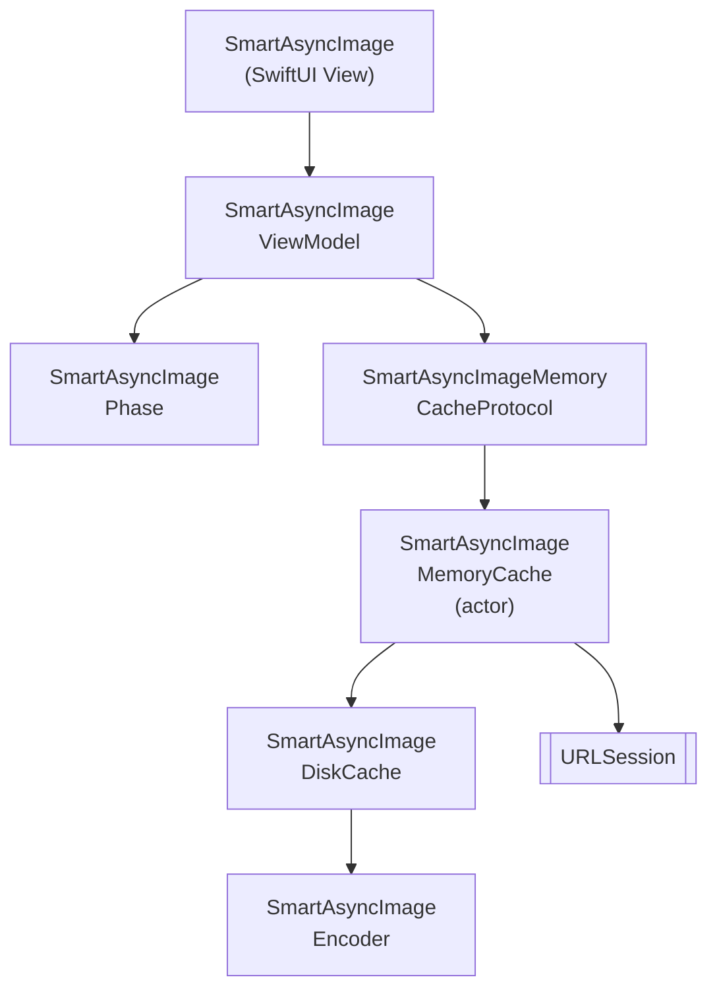

# SmartAsyncImage

SwiftUI (iOS)를 위한 더 스마트하고 빠른 `AsyncImage` 대체제. 메모리 및 디스크 캐싱, 취소, Swift 6 동시성을 기본 지원합니다.

[](https://github.com/gentle-giraffe-apps/SmartAsyncImage/actions/workflows/ci.yml)
[](https://codecov.io/gh/gentle-giraffe-apps/SmartAsyncImage)
[](https://swift.org)

[](https://swift.org/package-manager/)
[](https://developer.apple.com/ios/)


[](https://app.deepsource.com/gh/gentle-giraffe-apps/SmartAsyncImage/)

> 🌍 **언어** · [English](../README.md) · [Español](README.es.md) · [Português (Brasil)](README.pt-BR.md) · [日本語](README.ja.md) · [简体中文](README.zh-CN.md) · 한국어 · [Русский](README.ru.md)

## 특징
- Observable 뷰 모델을 갖춘 SwiftUI 친화적 API
- 스마트한 단계 관리: `empty`, `loading`, `success(Image)`, `failure(Error)`
- 플러그인 가능한 구현을 지원하는 메모리 캐시 프로토콜
- 앱 재시작 간 데이터를 유지하는 디스크 캐시
- Swift Concurrency (`async/await`) 및 협력적 취소
- MainActor 안전한 상태 업데이트

💬 **[토론에 참여하세요. 피드백과 질문을 환영합니다](https://github.com/gentle-giraffe-apps/SmartAsyncImage/discussions)**

## 요구 사항
- iOS 17+
- Swift 6.1+
- Swift Package Manager

## 📦 설치 (Swift Package Manager)

### Xcode를 통한 설치

1. Xcode에서 프로젝트를 엽니다
2. **File → Add Packages...** 로 이동합니다
3. 저장소 URL을 입력합니다: `https://github.com/gentle-giraffe-apps/SmartAsyncImage.git`
4. 버전 규칙을 선택합니다 (개발 중에는 `main` 선택 가능)
5. **SmartAsyncImage** 제품을 앱 타겟에 추가합니다

### `Package.swift`를 통한 설치

```swift
dependencies: [
    .package(url: "https://github.com/gentle-giraffe-apps/SmartAsyncImage.git", from: "1.0.0")
]
```

그런 다음 타겟의 `dependencies`에 `"SmartAsyncImage"`를 추가합니다.

## 데모 앱

로컬 패키지 참조를 사용하는 SwiftUI 데모 앱이 이 저장소에 포함되어 있습니다.

**경로:**
```
Demo/SmartAsyncImageDemo/SmartAsyncImageDemo.xcodeproj
```

### 실행 방법
1. 저장소를 클론합니다:
   ```bash
   git clone https://github.com/gentle-giraffe-apps/SmartAsyncImage.git
   ```
2. 데모 프로젝트를 엽니다:
   ```
   Demo/SmartAsyncImageDemo/SmartAsyncImageDemo.xcodeproj
   ```
3. iOS 17+ 시뮬레이터를 선택합니다.
4. 빌드 및 실행합니다 (⌘R).

프로젝트는 `SmartAsyncImage`에 대한 로컬 Swift Package 참조로 사전 구성되어 있으며, 추가 설정 없이 실행할 수 있습니다.

## 사용법

### 빠른 예제 (SwiftUI)
```swift
import SwiftUI
import SmartAsyncImage

struct MinimalRemoteImageView: View {
    let imageURL = URL(string: "https://picsum.photos/300")

    var body: some View {

        // 교체 전: AsyncImage(url: imageURL) { phase in
        // ------------------------------------------------
        // 교체 후:

        SmartAsyncImage(url: imageURL) { phase in

        // ------------------------------------------------

            switch phase {
            case .empty, .loading:
                ProgressView()
            case .success(let image):
                image.resizable().scaledToFit()
            case .failure:
                Image(systemName: "photo")
            }
        }
        .frame(width: 150, height: 150)
    }
}
```

## 품질 및 도구

이 프로젝트는 CI와 정적 분석을 통해 품질 관리를 시행합니다:

- **CI:** `main`에 대한 모든 커밋은 GitHub Actions 검사를 통과해야 합니다
- **정적 분석:** DeepSource가 `main`에 대한 모든 커밋에서 실행됩니다.
  배지는 현재 미해결 정적 분석 이슈 수를 나타냅니다.
- **테스트 커버리지:** Codecov가 `main` 브랜치의 라인 커버리지를 보고합니다

<sub><strong>Codecov 스냅샷</strong></sub><br/>
<a href="https://codecov.io/gh/gentle-giraffe-apps/SmartAsyncImage">
  
</a>

이러한 검사는 설계 시스템이 안전하게 발전할 수 있도록 하기 위한 것입니다.

---

## 아키텍처



---

## 🤖 도구 참고 사항

이 저장소의 초안 작성 및 편집 다듬기 일부는 대규모 언어 모델(ChatGPT, Claude, Gemini 포함)을 활용하여 가속되었으며, 인간의 직접적인 설계, 검증 및 최종 승인 하에 수행되었습니다. 모든 기술적 결정, 코드 및 아키텍처 결론은 저장소 관리자가 작성하고 검증했습니다.

---

## 🔐 라이선스

MIT 라이선스
개인 및 상업적 용도로 자유롭게 사용할 수 있습니다.

---

## 👤 저자

**Jonathan Ritchey** 제작
Gentle Giraffe Apps
시니어 iOS 엔지니어 --- Swift | SwiftUI | Concurrency


