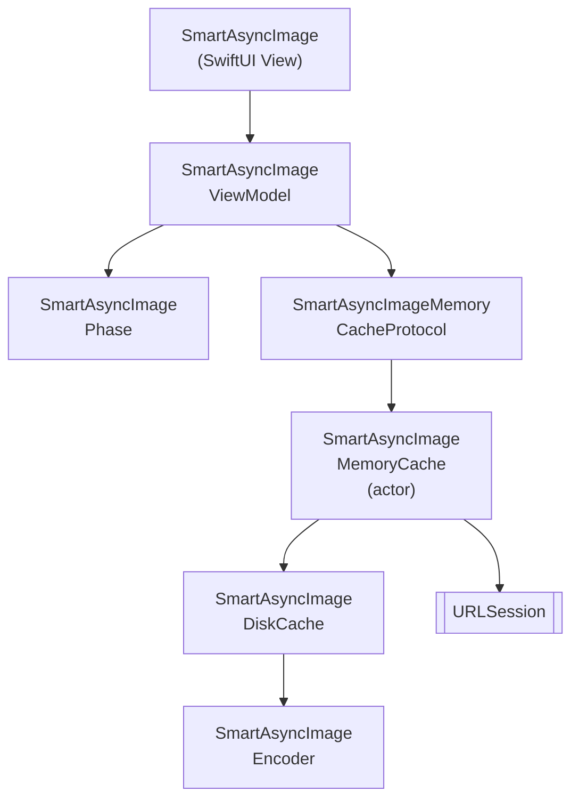

# SmartAsyncImage

Um `AsyncImage` para SwiftUI (iOS) mais inteligente e rápido, com cache em memória e em disco, cancelamento e concorrência do Swift 6.

[](https://github.com/gentle-giraffe-apps/SmartAsyncImage/actions/workflows/ci.yml)
[](https://codecov.io/gh/gentle-giraffe-apps/SmartAsyncImage)
[](https://swift.org)

[](https://swift.org/package-manager/)
[](https://developer.apple.com/ios/)


[](https://app.deepsource.com/gh/gentle-giraffe-apps/SmartAsyncImage/)

> 🌍 **Idioma** · [English](../README.md) · [Español](README.es.md) · Português (Brasil) · [日本語](README.ja.md) · [简体中文](README.zh-CN.md) · [한국어](README.ko.md) · [Русский](README.ru.md)

## Funcionalidades
- API compatível com SwiftUI com um view model observável
- Gerenciamento inteligente de fases: `empty`, `loading`, `success(Image)`, `failure(Error)`
- Protocolo de cache em memória com implementações intercambiáveis
- Cache em disco para persistência entre execuções
- Concorrência do Swift (`async/await`) com cancelamento cooperativo
- Atualizações de estado seguras no MainActor

💬 **[Participe da discussão. Feedback e perguntas são bem-vindos](https://github.com/gentle-giraffe-apps/SmartAsyncImage/discussions)**

## Requisitos
- iOS 17+
- Swift 6.1+
- Swift Package Manager

## 📦 Instalação (Swift Package Manager)

### Via Xcode

1. Abra seu projeto no Xcode
2. Vá em **File → Add Packages...**
3. Insira a URL do repositório: `https://github.com/gentle-giraffe-apps/SmartAsyncImage.git`
4. Escolha uma regra de versão (ou `main` durante o desenvolvimento)
5. Adicione o produto **SmartAsyncImage** ao target do seu app

### Via `Package.swift`

```swift
dependencies: [
    .package(url: "https://github.com/gentle-giraffe-apps/SmartAsyncImage.git", from: "1.0.0")
]
```

Em seguida, adicione `"SmartAsyncImage"` às `dependencies` do seu target.

## App de Demonstração

Um app de demonstração em SwiftUI está incluído neste repositório usando uma referência local ao pacote.

**Caminho:**
```
Demo/SmartAsyncImageDemo/SmartAsyncImageDemo.xcodeproj
```

### Como Executar
1. Clone o repositório:
   ```bash
   git clone https://github.com/gentle-giraffe-apps/SmartAsyncImage.git
   ```
2. Abra o projeto de demonstração:
   ```
   Demo/SmartAsyncImageDemo/SmartAsyncImageDemo.xcodeproj
   ```
3. Selecione um simulador com iOS 17+.
4. Compile e execute (⌘R).

O projeto já está configurado com uma referência local de Swift Package para `SmartAsyncImage` e deve executar sem configuração adicional.

## Uso

### Exemplo Rápido (SwiftUI)
```swift
import SwiftUI
import SmartAsyncImage

struct MinimalRemoteImageView: View {
    let imageURL = URL(string: "https://picsum.photos/300")

    var body: some View {

        // substitua: AsyncImage(url: imageURL) { phase in
        // ------------------------------------------------
        // por:

        SmartAsyncImage(url: imageURL) { phase in

        // ------------------------------------------------

            switch phase {
            case .empty, .loading:
                ProgressView()
            case .success(let image):
                image.resizable().scaledToFit()
            case .failure:
                Image(systemName: "photo")
            }
        }
        .frame(width: 150, height: 150)
    }
}
```

## Qualidade e Ferramentas

Este projeto aplica controles de qualidade via CI e análise estática:

- **CI:** Todos os commits em `main` devem passar nas verificações do GitHub Actions
- **Análise estática:** O DeepSource é executado em cada commit em `main`.
  O badge indica o número atual de problemas pendentes de análise estática.
- **Cobertura de testes:** O Codecov reporta a cobertura de linhas para a branch `main`

<sub><strong>Captura do Codecov</strong></sub><br/>
<a href="https://codecov.io/gh/gentle-giraffe-apps/SmartAsyncImage">
  
</a>

Essas verificações têm como objetivo manter o sistema de design seguro para evoluir ao longo do tempo.

---

## Arquitetura



---

## 🤖 Nota sobre Ferramentas

Partes da redação e do refinamento editorial neste repositório foram aceleradas utilizando modelos de linguagem grandes (incluindo ChatGPT, Claude e Gemini) sob design, validação e aprovação final humana direta. Todas as decisões técnicas, código e conclusões arquiteturais são de autoria e verificação do mantenedor do repositório.

---

## 🔐 Licença

Licença MIT
Livre para uso pessoal e comercial.

---

## 👤 Autor

Criado por **Jonathan Ritchey**
Gentle Giraffe Apps
Engenheiro Senior de iOS --- Swift | SwiftUI | Concurrency


