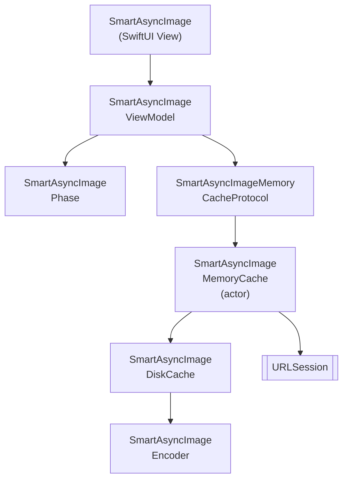

# SmartAsyncImage

Более умная и быстрая замена `AsyncImage` для SwiftUI (iOS) со встроенным кэшированием в памяти и на диске, отменой и поддержкой конкурентности Swift 6.

[](https://github.com/gentle-giraffe-apps/SmartAsyncImage/actions/workflows/ci.yml)
[](https://codecov.io/gh/gentle-giraffe-apps/SmartAsyncImage)
[](https://swift.org)

[](https://swift.org/package-manager/)
[](https://developer.apple.com/ios/)


[](https://app.deepsource.com/gh/gentle-giraffe-apps/SmartAsyncImage/)

> 🌍 **Язык** · [English](../README.md) · [Español](README.es.md) · [Português (Brasil)](README.pt-BR.md) · [日本語](README.ja.md) · [简体中文](README.zh-CN.md) · [한국어](README.ko.md) · Русский

## Возможности
- SwiftUI-совместимый API с наблюдаемой моделью представления
- Умное управление фазами: `empty`, `loading`, `success(Image)`, `failure(Error)`
- Протокол кэширования в памяти с подключаемыми реализациями
- Дисковый кэш для сохранения данных между запусками приложения
- Swift Concurrency (`async/await`) с кооперативной отменой
- Безопасное обновление состояния на MainActor

💬 **[Присоединяйтесь к обсуждению. Обратная связь и вопросы приветствуются](https://github.com/gentle-giraffe-apps/SmartAsyncImage/discussions)**

## Требования
- iOS 17+
- Swift 6.1+
- Swift Package Manager

## 📦 Установка (Swift Package Manager)

### Через Xcode

1. Откройте свой проект в Xcode
2. Перейдите в **File → Add Packages...**
3. Введите URL репозитория: `https://github.com/gentle-giraffe-apps/SmartAsyncImage.git`
4. Выберите правило версионирования (или `main` для разработки)
5. Добавьте продукт **SmartAsyncImage** в целевой модуль вашего приложения

### Через `Package.swift`

```swift
dependencies: [
    .package(url: "https://github.com/gentle-giraffe-apps/SmartAsyncImage.git", from: "1.0.0")
]
```

Затем добавьте `"SmartAsyncImage"` в `dependencies` вашего целевого модуля.

## Демо-приложение

В этом репозитории находится демо-приложение на SwiftUI, использующее локальную ссылку на пакет.

**Путь:**
```
Demo/SmartAsyncImageDemo/SmartAsyncImageDemo.xcodeproj
```

### Как запустить
1. Клонируйте репозиторий:
   ```bash
   git clone https://github.com/gentle-giraffe-apps/SmartAsyncImage.git
   ```
2. Откройте демо-проект:
   ```
   Demo/SmartAsyncImageDemo/SmartAsyncImageDemo.xcodeproj
   ```
3. Выберите симулятор с iOS 17+.
4. Соберите и запустите (⌘R).

Проект предварительно настроен с локальной ссылкой на Swift Package `SmartAsyncImage` и должен запускаться без дополнительной настройки.

## Использование

### Быстрый пример (SwiftUI)
```swift
import SwiftUI
import SmartAsyncImage

struct MinimalRemoteImageView: View {
    let imageURL = URL(string: "https://picsum.photos/300")

    var body: some View {

        // замените: AsyncImage(url: imageURL) { phase in
        // ------------------------------------------------
        // на:

        SmartAsyncImage(url: imageURL) { phase in

        // ------------------------------------------------

            switch phase {
            case .empty, .loading:
                ProgressView()
            case .success(let image):
                image.resizable().scaledToFit()
            case .failure:
                Image(systemName: "photo")
            }
        }
        .frame(width: 150, height: 150)
    }
}
```

## Качество и инструменты

Этот проект обеспечивает контроль качества через CI и статический анализ:

- **CI:** Все коммиты в `main` должны проходить проверки GitHub Actions
- **Статический анализ:** DeepSource запускается при каждом коммите в `main`.
  Значок показывает текущее количество нерешённых проблем статического анализа.
- **Покрытие тестами:** Codecov отчитывается о покрытии строк для ветки `main`

<sub><strong>Снимок Codecov</strong></sub><br/>
<a href="https://codecov.io/gh/gentle-giraffe-apps/SmartAsyncImage">
  
</a>

Эти проверки предназначены для того, чтобы дизайн-система могла безопасно развиваться со временем.

---

## Архитектура



---

## 🤖 Примечание об инструментах

Часть работы над черновиками и редакторской доработкой в этом репозитории была ускорена с помощью больших языковых моделей (включая ChatGPT, Claude и Gemini) под непосредственным руководством, проверкой и окончательным утверждением человека. Все технические решения, код и архитектурные выводы создаются и проверяются мейнтейнером репозитория.

---

## 🔐 Лицензия

Лицензия MIT
Свободно для личного и коммерческого использования.

---

## 👤 Автор

Создано **Jonathan Ritchey**
Gentle Giraffe Apps
Старший iOS-инженер --- Swift | SwiftUI | Concurrency


