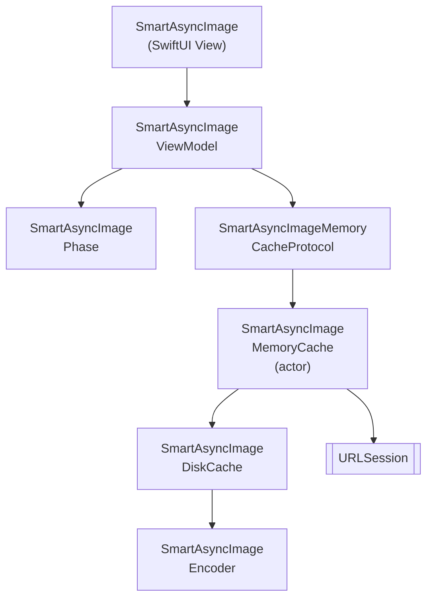

# SmartAsyncImage

一个更智能、更快速的 SwiftUI (iOS) `AsyncImage` 替代方案，内置内存和磁盘缓存、取消机制以及 Swift 6 并发支持。

[](https://github.com/gentle-giraffe-apps/SmartAsyncImage/actions/workflows/ci.yml)
[](https://codecov.io/gh/gentle-giraffe-apps/SmartAsyncImage)
[](https://swift.org)

[](https://swift.org/package-manager/)
[](https://developer.apple.com/ios/)


[](https://app.deepsource.com/gh/gentle-giraffe-apps/SmartAsyncImage/)

> 🌍 **语言** · [English](../README.md) · [Español](README.es.md) · [Português (Brasil)](README.pt-BR.md) · [日本語](README.ja.md) · 简体中文 · [한국어](README.ko.md) · [Русский](README.ru.md)

## 特性
- 兼容 SwiftUI 的 API，配备可观察的视图模型
- 智能阶段管理：`empty`、`loading`、`success(Image)`、`failure(Error)`
- 内存缓存协议，支持可插拔实现
- 磁盘缓存，支持跨应用启动的持久化
- Swift 并发（`async/await`）与协作式取消
- MainActor 安全的状态更新

💬 **[参与讨论，欢迎反馈和提问](https://github.com/gentle-giraffe-apps/SmartAsyncImage/discussions)**

## 环境要求
- iOS 17+
- Swift 6.1+
- Swift Package Manager

## 📦 安装（Swift Package Manager）

### 通过 Xcode

1. 在 Xcode 中打开你的项目
2. 前往 **File → Add Packages...**
3. 输入仓库 URL：`https://github.com/gentle-giraffe-apps/SmartAsyncImage.git`
4. 选择版本规则（开发阶段可选 `main`）
5. 将 **SmartAsyncImage** 产品添加到你的应用目标

### 通过 `Package.swift`

```swift
dependencies: [
    .package(url: "https://github.com/gentle-giraffe-apps/SmartAsyncImage.git", from: "1.0.0")
]
```

然后将 `"SmartAsyncImage"` 添加到目标的 `dependencies` 中。

## 示例应用

本仓库包含一个使用本地包引用的 SwiftUI 示例应用。

**路径：**
```
Demo/SmartAsyncImageDemo/SmartAsyncImageDemo.xcodeproj
```

### 运行方法
1. 克隆仓库：
   ```bash
   git clone https://github.com/gentle-giraffe-apps/SmartAsyncImage.git
   ```
2. 打开示例项目：
   ```
   Demo/SmartAsyncImageDemo/SmartAsyncImageDemo.xcodeproj
   ```
3. 选择 iOS 17+ 模拟器。
4. 构建并运行（⌘R）。

该项目已预配置对 `SmartAsyncImage` 的本地 Swift Package 引用，无需额外配置即可运行。

## 用法

### 快速示例（SwiftUI）
```swift
import SwiftUI
import SmartAsyncImage

struct MinimalRemoteImageView: View {
    let imageURL = URL(string: "https://picsum.photos/300")

    var body: some View {

        // 替换前: AsyncImage(url: imageURL) { phase in
        // ------------------------------------------------
        // 替换后:

        SmartAsyncImage(url: imageURL) { phase in

        // ------------------------------------------------

            switch phase {
            case .empty, .loading:
                ProgressView()
            case .success(let image):
                image.resizable().scaledToFit()
            case .failure:
                Image(systemName: "photo")
            }
        }
        .frame(width: 150, height: 150)
    }
}
```

## 质量与工具

本项目通过 CI 和静态分析实施质量管控：

- **CI：** 所有提交到 `main` 的代码必须通过 GitHub Actions 检查
- **静态分析：** DeepSource 在每次提交到 `main` 时运行。
  徽章显示当前未解决的静态分析问题数量。
- **测试覆盖率：** Codecov 报告 `main` 分支的行覆盖率

<sub><strong>Codecov 快照</strong></sub><br/>
<a href="https://codecov.io/gh/gentle-giraffe-apps/SmartAsyncImage">
  
</a>

这些检查旨在确保设计系统能够安全地持续演进。

---

## 架构



---

## 🤖 工具说明

本仓库中部分文稿撰写和编辑润色借助了大语言模型（包括 ChatGPT、Claude 和 Gemini）加速完成，但均在人工直接设计、验证和最终审批下进行。所有技术决策、代码和架构结论均由仓库维护者编写和验证。

---

## 🔐 许可证

MIT 许可证
可自由用于个人和商业用途。

---

## 👤 作者

由 **Jonathan Ritchey** 构建
Gentle Giraffe Apps
高级 iOS 工程师 --- Swift | SwiftUI | Concurrency


