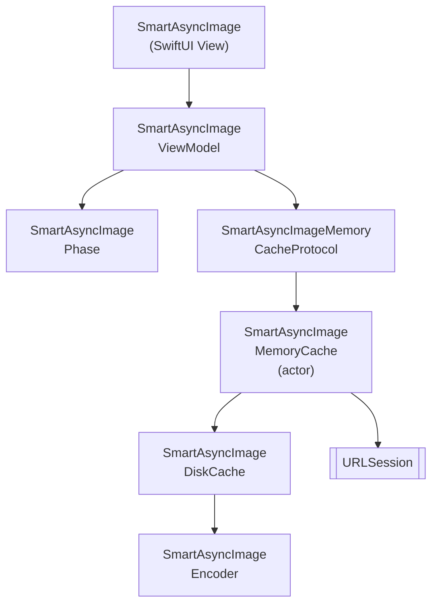

# SmartAsyncImage

A smarter, faster `AsyncImage` for SwiftUI (iOS) with built-in in-memory and disk caching, cancellation, and Swift 6 concurrency.

[](https://github.com/gentle-giraffe-apps/SmartAsyncImage/actions/workflows/ci.yml)
[](https://codecov.io/gh/gentle-giraffe-apps/SmartAsyncImage)
[](https://swift.org)

[](https://swift.org/package-manager/)
[](https://developer.apple.com/ios/)


[](https://app.deepsource.com/gh/gentle-giraffe-apps/SmartAsyncImage/)

> 🌍 **Language** · English · [Español](Docs/README.es.md) · [Português (Brasil)](Docs/README.pt-BR.md) · [日本語](Docs/README.ja.md)

## Features
- SwiftUI-friendly API with an observable view model
- Smart phase handling: `empty`, `loading`, `success(Image)`, `failure(Error)`
- In-memory caching protocol with pluggable implementations
- Disk cache for persistence across launches
- Swift Concurrency (`async/await`) with cooperative cancellation
- MainActor-safe state updates

💬 **[Join the discussion. Feedback and questions welcome](https://github.com/gentle-giraffe-apps/SmartAsyncImage/discussions)**

## Requirements
- iOS 17+
- Swift 6.1+
- Swift Package Manager

## 📦 Installation (Swift Package Manager)

### Via Xcode

1. Open your project in Xcode
2. Go to **File → Add Packages...**
3. Enter the repository URL: `https://github.com/gentle-giraffe-apps/SmartAsyncImage.git`
4. Choose a version rule (or `main` while developing)
5. Add the **SmartAsyncImage** product to your app target

### Via `Package.swift`

```swift
dependencies: [
    .package(url: "https://github.com/gentle-giraffe-apps/SmartAsyncImage.git", from: "1.0.0")
]
```

Then add `"SmartAsyncImage"` to the `dependencies` of your target.

## Demo App

A runnable SwiftUI demo app is included in this repository using a local package reference.

**Path:**
```
Demo/SmartAsyncImageDemo/SmartAsyncImageDemo.xcodeproj
```

### How to Run
1. Clone the repository:
   ```bash
   git clone https://github.com/gentle-giraffe-apps/SmartAsyncImage.git
   ```
2. Open the demo project:
   ```
   Demo/SmartAsyncImageDemo/SmartAsyncImageDemo.xcodeproj
   ```
3. Select an iOS 17+ simulator.
4. Build & Run (⌘R).

The project is preconfigured with a local Swift Package reference to `SmartAsyncImage` and should run without any additional setup.

## Usage

### Quick Example (SwiftUI)
```swift
import SwiftUI
import SmartAsyncImage

struct MinimalRemoteImageView: View {
    let imageURL = URL(string: "https://picsum.photos/300")

    var body: some View {
    
        // replace: AsyncImage(url: imageURL) { phase in
        // ---------------------------------------------
        // with:
        
        SmartAsyncImage(url: imageURL) { phase in
        
        // ----------------------------------------------
        
            switch phase {
            case .empty, .loading:
                ProgressView()
            case .success(let image):
                image.resizable().scaledToFit()
            case .failure:
                Image(systemName: "photo")
            }
        }
        .frame(width: 150, height: 150)
    }
}
```

## Quality & Tooling

This project enforces quality gates via CI and static analysis:

- **CI:** All commits to `main` must pass GitHub Actions checks
- **Static analysis:** DeepSource runs on every commit to `main`.  
  The badge indicates the current number of outstanding static analysis issues.
- **Test coverage:** Codecov reports line coverage for the `main` branch

<sub><strong>Codecov Snapshot</strong></sub><br/>
<a href="https://codecov.io/gh/gentle-giraffe-apps/SmartAsyncImage">
  
</a>

These checks are intended to keep the design system safe to evolve over time.

---

## Architecture



---

## 🤖 Tooling Note

Portions of drafting and editorial refinement in this repository were accelerated using large language models (including ChatGPT, Claude, and Gemini) under direct human design, validation, and final approval. All technical decisions, code, and architectural conclusions are authored and verified by the repository maintainer.

---

## 🔐 License

MIT License
Free for personal and commercial use.

---

## 👤 Author

Built by **Jonathan Ritchey**
Gentle Giraffe Apps
Senior iOS Engineer --- Swift | SwiftUI | Concurrency


