# SmartAsyncImage

A smarter, faster `AsyncImage` for SwiftUI with built-in in-memory and disk caching, cancellation, and Swift 6 concurrency.

[](https://github.com/gentle-giraffe-apps/SmartAsyncImage/actions/workflows/ci.yml)
[](https://codecov.io/gh/gentle-giraffe-apps/SmartAsyncImage)
[](https://swift.org)
[](https://swift.org/package-manager/)
[](https://developer.apple.com/ios/)
[](LICENSE)

## Features
- SwiftUI-friendly API with an observable view model
- Smart phase handling: `empty`, `loading`, `success(Image)`, `failure(Error)`
- In-memory caching protocol with pluggable implementations
- Disk cache for persistence across launches
- Swift Concurrency (`async/await`) with cooperative cancellation
- MainActor-safe state updates

## Requirements
- iOS 17+
- Swift 6.2+
- Swift Package Manager

## Demo App

A runnable SwiftUI demo app is included in this repository using a local package reference.

**Path:**
```
Demo/SmartAsyncImageDemo/SmartAsyncDemo.xcodeproj
```

### How to Run
1. Clone the repository:
   ```bash
   git clone https://github.com/gentle-giraffe-apps/SmartAsyncImage.git
   ```
2. Open the demo project:
   ```
   Demo/SmartAsyncImageDemo/SmartAsyncDemo.xcodeproj
   ```
3. Select an iOS 17+ simulator.
4. Build & Run (⌘R).

The project is preconfigured with a local Swift Package reference to `SmartAsyncImage` and should run without any additional setup.

## Usage

### Quick Example (SwiftUI)
```swift
import SwiftUI
import SmartAsyncImage

struct MinimalRemoteImageView: View {
    let imageURL = URL(string: "https://picsum.photos/300")

    var body: some View {
    
        // replace: AsyncImage(url: imageURL) { phase in
        // ---------------------------------------------
        // with:
        
        SmartAsyncImage(url: imageURL) { phase in
        
        // ----------------------------------------------
        
            switch phase {
            case .empty:
                ProgressView()
            case .success(let image):
                image.resizable().scaledToFit()
            case .failure:
                Image(systemName: "photo")
            @unknown default:
                EmptyView()
            }
        }
        .frame(width: 150, height: 150)
    }
}
```

## Architecture

```mermaid
flowchart TD
    SAI["<div style='padding:6px 12px; white-space:nowrap;'>SmartAsyncImage__<br/>(SwiftUI View)</div>"] --> VM["<div style='padding:6px 12px; white-space:nowrap;'>SmartAsyncImage__<br/>ViewModel</div>"]
    VM --> Phase["<div style='padding:6px 12px; white-space:nowrap;'>SmartAsyncImage__<br/>Phase</div>"]
    VM --> MemProto["<div style='padding:6px 12px; white-space:nowrap;'>SmartAsyncImageMemory<br/>CacheProtocol</div>"]
    MemProto --> Mem["<div style='padding:6px 12px; white-space:nowrap;'>SmartAsyncImage__<br/>MemoryCache<br/>(actor)</div>"]
    Mem --> Disk["<div style='padding:6px 12px; white-space:nowrap;'>SmartAsyncImage__<br/>DiskCache</div>"]
    Disk --> Encoder["<div style='padding:6px 12px; white-space:nowrap;'>SmartAsyncImage__<br/>Encoder</div>"]
    Mem --> URLSession[["<div style='padding:6px 12px; white-space:nowrap;'>URLSession·</div>"]]
```



---

## 🤖 Tooling Note

Portions of drafting and editorial refinement in this repository were accelerated using large language models (including ChatGPT, Claude, and Gemini) under direct human design, validation, and final approval. All technical decisions, code, and architectural conclusions are authored and verified by the repository maintainer.

---

## 🔐 License

MIT License
Free for personal and commercial use.

---

## 👤 Author

Built by **Jonathan Ritchey**
Gentle Giraffe Apps
Senior iOS Engineer --- Swift | SwiftUI | Concurrency

